# 📱 65132908 - Android Programming

> Repository môn học **Lập trình Android** — Tổng hợp các bài thực hành xây dựng ứng dụng Android sử dụng Java.

---

## 📋 Mục lục

- [Giới thiệu](#-giới-thiệu)
- [Công nghệ sử dụng](#-công-nghệ-sử-dụng)
- [Cấu trúc dự án](#-cấu-trúc-dự-án)
- [Danh sách ứng dụng](#-danh-sách-ứng-dụng)
  - [1. HelloAndroid](#1-helloandroid)
  - [2. AppTinhTong — Tính Tổng Hai Số](#2-apptinhtong--tính-tổng-hai-số)
  - [3. AppCong — Tính Tổng (onClick XML)](#3-appcong--tính-tổng-onclick-xml)
  - [4. BaiTH4_1 — LinearLayout & Button](#4-baith4_1--linearlayout--button)
  - [5. BaiTH4_2 — Máy Tính Bỏ Túi](#5-baith4_2--máy-tính-bỏ-túi)
  - [6. BaiTH5 — Xử Lý Sự Kiện (Máy Tính)](#6-baith5--xử-lý-sự-kiện-máy-tính)
  - [7. AppCongTruNhanChia — Cộng Trừ Nhân Chia](#7-appcongtruhnanchia--cộng-trừ-nhân-chia)
  - [8. DanhSachCacTinhThanh — ListView Tỉnh Thành](#8-danhsachcactinhthanh--listview-tỉnh-thành)
  - [9. DanhSachVatLieuVaDanhSachMonAn — ListView Vật Liệu & Món Ăn](#9-danhsachvatlieuvanhdanhsachmonan--listview-vật-liệu--món-ăn)
  - [10. AppMonAn — Custom ListView Món Ăn](#10-appmonan--custom-listview-món-ăn)
  - [11. DSSinhVienVaMonHoc — ListView Sinh Viên & Môn Học](#11-dssinhvienvamonhoc--listview-sinh-viên--môn-học)
  - [12. DSSanPhamVaNhaCungCap — ListView Sản Phẩm & Nhà Cung Cấp](#12-dssanphamvanhacungcap--listview-sản-phẩm--nhà-cung-cấp)
  - [13. DanhSachCacCanhQuan — RecyclerView & CardView](#13-danhsachcaccanhquan--recyclerview--cardview)
  - [14. VN_Express_Rss — Đọc Tin RSS VnExpress](#14-vn_express_rss--đọc-tin-rss-vnexpress)
- [Yêu cầu hệ thống](#-yêu-cầu-hệ-thống)
- [Hướng dẫn cài đặt và chạy](#-hướng-dẫn-cài-đặt-và-chạy)
- [Tác giả](#-tác-giả)

---

## 🎯 Giới thiệu

Đây là repository chứa các bài thực hành môn **Lập trình Android** với mã sinh viên **65132908**. Mỗi thư mục con tương ứng với một ứng dụng Android riêng biệt, được xây dựng nhằm rèn luyện các kỹ năng phát triển ứng dụng di động trên nền tảng Android — từ giao diện cơ bản, xử lý sự kiện, đến làm việc với `ListView`, `RecyclerView`, Custom Adapter và lưu trữ dữ liệu.

---

## 🛠 Công nghệ sử dụng

| Công nghệ | Chi tiết |
|---|---|
| **Ngôn ngữ** | Java 11 |
| **Build System** | Gradle (Kotlin DSL) |
| **Min SDK** | 24 (Android 7.0 Nougat) |
| **Target / Compile SDK** | 36 |
| **UI Framework** | ConstraintLayout, LinearLayout, RecyclerView, CardView, Material Design |
| **IDE** | Android Studio |
| **Thư viện chính** | AndroidX AppCompat, Material Components, RecyclerView, CardView, SwipeRefreshLayout |

---

## 📁 Cấu trúc dự án

```
65132908-AndroidProgramming/
├── HelloAndroid/                          # Bài 1: Ứng dụng Hello World
├── AppTinhTong/                           # Bài 2: Tính Tổng Hai Số
├── AppCong/                               # Bài 3: Tính Tổng (onClick XML)
├── BaiTH4_1LinearLayOut_Tong2So/          # Bài 4: LinearLayout & Button
├── BaiTH4_2LinearLayOut_Tong2So/          # Bài 5: Máy Tính Bỏ Túi
├── BaiTH5_XuLySuKien1/                   # Bài 6: Xử Lý Sự Kiện (Máy Tính)
├── AppCongTruNhanChia/                    # Bài 7: Cộng Trừ Nhân Chia
├── DanhSachCacTinhThanh/                  # Bài 8: ListView Tỉnh Thành
├── DanhSachVatLieuVaDanhSachMonAn/        # Bài 9: ListView Vật Liệu & Món Ăn
├── AppMonAn/                              # Bài 10: Custom ListView Món Ăn
├── DSSinhVienVaMonHoc/                    # Bài 11: ListView Sinh Viên & Môn Học
├── DSSanPhamVaNhaCungCap/                 # Bài 12: ListView Sản Phẩm & Nhà Cung Cấp
├── DanhSachCacCanhQuan/                   # Bài 13: RecyclerView & CardView Cảnh Quan
├── VN_Express_Rss/                        # Bài 14: Đọc Tin RSS VnExpress
├── Images/                                # Thư mục chứa ảnh minh hoạ
└── README.md
```

---

## 📦 Danh sách ứng dụng

### 1. HelloAndroid

> 🟢 Ứng dụng đầu tiên — Làm quen với Android Studio và cấu trúc project Android.

- **Package:** `tiil.edu.helloandroid`
- **Mô tả:** Ứng dụng "Hello World" cơ bản, hiển thị dòng chữ **"Hello World!"** ở giữa màn hình.
- **Tính năng:**
  - Hiển thị văn bản trung tâm bằng `TextView` + `ConstraintLayout`
  - Hỗ trợ giao diện Edge-to-Edge (tràn viền)
  - Xử lý Window Insets cho System Bars
- **Kiến thức áp dụng:**
  - Tạo project Android mới
  - Cấu trúc thư mục `src/main/java` và `src/main/res`
  - Layout XML cơ bản với `ConstraintLayout`
  - Vòng đời Activity (`onCreate`)

<p align="center">
  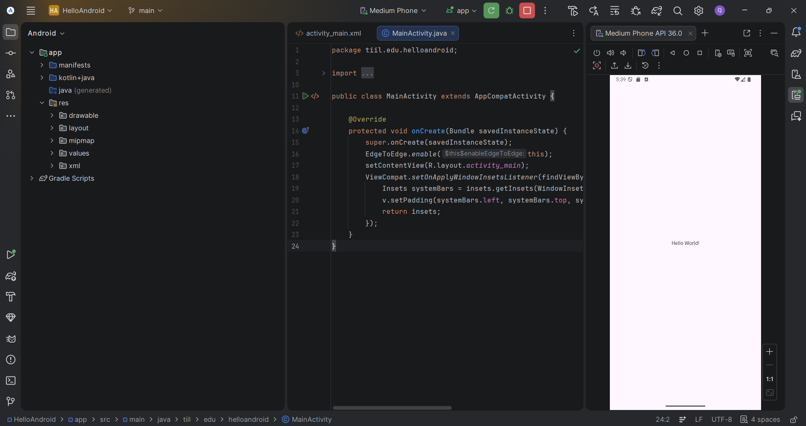
</p>

---

### 2. AppTinhTong — Tính Tổng Hai Số

> 🔵 Ứng dụng tính tổng — Thực hành xử lý sự kiện bằng `android:onClick` trong XML.

- **Package:** `tiil.edu.appcong`
- **Thư mục:** `AppTinhTong/`
- **Mô tả:** Ứng dụng cho phép nhập hai số nguyên **a** và **b**, tính tổng và hiển thị kết quả bằng phương thức `XuLyCong` được gọi trực tiếp từ XML thông qua `android:onClick`.
- **Giao diện bao gồm:**
  - `EditText` **edtA** — Ô nhập số a
  - `EditText` **edtB** — Ô nhập số b
  - `Button` — Nút tính tổng (kết nối `XuLyCong` qua `android:onClick`)
  - `EditText` **edtKQ** — Ô hiển thị kết quả
- **Kiến thức áp dụng:**
  - Xử lý sự kiện bằng `android:onClick` trong XML layout
  - `findViewById()` để ánh xạ view
  - Chuyển đổi `String` → `int` với `Integer.parseInt()`

<p align="center">
  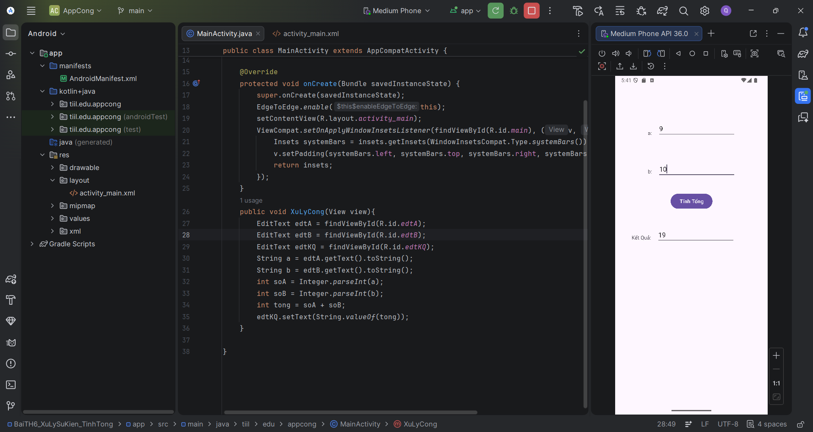
</p>

---

### 3. AppCong — Tính Tổng (onClick XML)

> 🔵 Ứng dụng tính tổng hai số — Thực hành xử lý sự kiện và tương tác UI.

- **Package:** `tiil.edu.appcong`
- **Thư mục:** `AppCong/`
- **Mô tả:** Ứng dụng cho phép người dùng nhập hai số **a** và **b**, sau đó tính và hiển thị tổng khi nhấn nút **"Tính Tổng"**.
- **Giao diện bao gồm:**
  - `EditText` **edtA** — Ô nhập số a
  - `EditText` **edtB** — Ô nhập số b
  - `Button` **btnCong** — Nút "Tính Tổng" (gọi phương thức `XuLyCong` qua `android:onClick`)
  - `EditText` **edtKQ** — Ô hiển thị kết quả
- **Kiến thức áp dụng:**
  - Thiết kế giao diện với nhiều widget (`EditText`, `Button`, `TextView`)
  - Bố cục bằng `ConstraintLayout` với ràng buộc giữa các view
  - Xử lý sự kiện bằng thuộc tính `android:onClick` trong XML
  - Chuyển đổi kiểu dữ liệu (`String` → `int`) và xử lý kết quả

---

### 4. BaiTH4_1 — LinearLayout & Button

> 🟡 Thực hành bố cục tuyến tính — Làm quen với `LinearLayout` và tùy chỉnh giao diện `Button`.

- **Package:** `tiil.edu.vd1`
- **Thư mục:** `BaiTH4_1LinearLayOut_Tong2So/`
- **Mô tả:** Ứng dụng minh hoạ cách sử dụng `LinearLayout` theo chiều dọc (`vertical`) để sắp xếp ba nút bấm với giao diện tuỳ chỉnh.
- **Giao diện bao gồm:**
  - `Button` **nutSO1** — "NÚT SỐ 1"
  - `Button` **nutSO2** — "NÚT SỐ 2"
  - `Button` **nutSO3** — "NÚT SỐ 3"
  - Các nút có: chữ màu vàng (`#FFEB3B`), nền tím (`#9C27B0`), cỡ chữ 20dp
- **Kiến thức áp dụng:**
  - Sử dụng `LinearLayout` với `orientation="vertical"` và `gravity="center"`
  - Tuỳ chỉnh giao diện Button: `textColor`, `background`, `textSize`
  - Sử dụng `layout_marginTop` để tạo khoảng cách giữa các view

---

### 5. BaiTH4_2 — Máy Tính Bỏ Túi

> 🟣 Ứng dụng máy tính hoàn chỉnh — Thực hành xử lý nhiều phép tính và kiểm tra đầu vào.

- **Package:** `tiil.edu.vd2`
- **Thư mục:** `BaiTH4_2LinearLayOut_Tong2So/`
- **Mô tả:** Ứng dụng máy tính bỏ túi hỗ trợ **4 phép tính** cơ bản: Cộng (+), Trừ (−), Nhân (×), Chia (÷). Có xử lý ngoại lệ cho trường hợp chia cho 0 và nhập liệu không hợp lệ.
- **Giao diện bao gồm:**
  - `EditText` **edtSoThuNhat** — Ô nhập số thứ nhất
  - `EditText` **edtSoThuHai** — Ô nhập số thứ hai
  - `Button` **btnCong, btnTru, btnNhan, btnChia** — 4 nút phép tính
  - `EditText` **edtKetQua** — Ô hiển thị kết quả
- **Tính năng nổi bật:**
  - Hỗ trợ nhập số thập phân và số âm
  - Kiểm tra đầu vào: thông báo `Toast` khi chưa nhập đủ hoặc nhập sai định dạng
  - Xử lý chia cho 0 với cảnh báo `Toast`
- **Kiến thức áp dụng:**
  - Bố cục phức tạp với `LinearLayout` lồng nhau (horizontal + vertical)
  - Xử lý sự kiện bằng `setOnClickListener`
  - Try-catch xử lý `NumberFormatException`

---

### 6. BaiTH5 — Xử Lý Sự Kiện (Máy Tính)

> 🟠 Ứng dụng máy tính — Thực hành xử lý sự kiện với `setOnClickListener` và kiểu `float`.

- **Package:** `tiil.edu.baith5_xulysukien1`
- **Thư mục:** `BaiTH5_XuLySuKien1/`
- **Mô tả:** Ứng dụng máy tính cơ bản hỗ trợ 4 phép tính: Cộng, Trừ, Nhân, Chia. Mỗi phép tính được xử lý bởi một phương thức riêng biệt.
- **Giao diện bao gồm:**
  - `EditText` **editTextSo1** — Ô nhập số thứ nhất
  - `EditText` **editTextSo2** — Ô nhập số thứ hai
  - `Button` **nutCong, nutTru, nutNhan, nutChia** — 4 nút phép tính
  - `EditText` **editTextKQ** — Ô hiển thị kết quả
- **Kiến thức áp dụng:**
  - Xử lý sự kiện bằng `setOnClickListener` với anonymous class
  - Chuyển đổi kiểu dữ liệu `String` → `float` với `Float.parseFloat()`
  - Tách logic xử lý thành các phương thức riêng biệt

---

### 7. AppCongTruNhanChia — Cộng Trừ Nhân Chia

> 🟠 Ứng dụng Cộng Trừ Nhân Chia — Xử lý 4 phép tính với kiểm tra chia cho 0.

- **Package:** `tiil.edu.baith5_xulysukien1`
- **Thư mục:** `AppCongTruNhanChia/`
- **Mô tả:** Ứng dụng máy tính hỗ trợ 4 phép tính cơ bản (Cộng, Trừ, Nhân, Chia) với xử lý lỗi khi chia cho 0. Tính toán sử dụng kiểu `float`.
- **Tính năng nổi bật:**
  - 4 phép tính: Cộng, Trừ, Nhân, Chia
  - Xử lý trường hợp mẫu bằng 0 (hiển thị thông báo lỗi)
  - Mỗi phép tính có phương thức xử lý riêng (`XULY_CONG`, `XULY_TRU`, `XULY_NHAN`, `XULY_CHIA`)
- **Kiến thức áp dụng:**
  - Xử lý sự kiện bằng `setOnClickListener`
  - Tách logic xử lý thành phương thức riêng biệt
  - Kiểm tra điều kiện chia cho 0

<p align="center">
  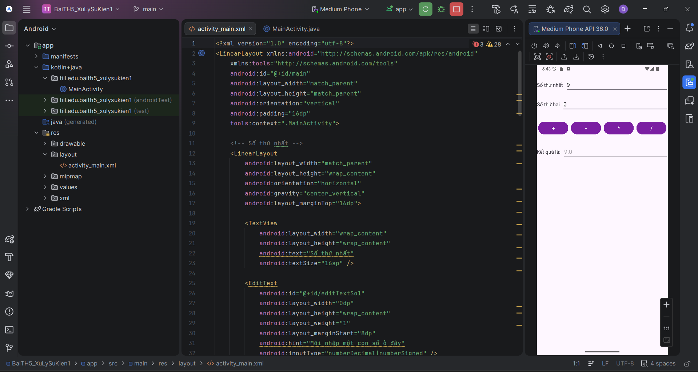
  &nbsp;&nbsp;
  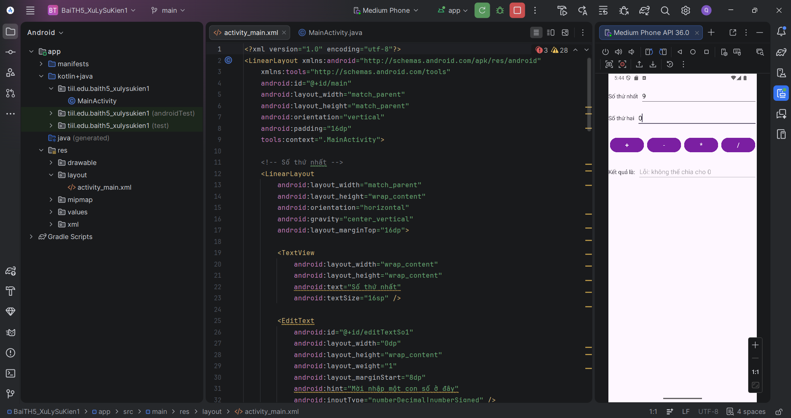
</p>

---

### 8. DanhSachCacTinhThanh — ListView Tỉnh Thành

> 🟤 ListView Danh Sách Tỉnh Thành — Thực hành `ListView` và `ArrayAdapter` với dữ liệu tỉnh thành Việt Nam.

- **Package:** `ntquy.ntu.baith7_listview2`
- **Thư mục:** `DanhSachCacTinhThanh/`
- **Mô tả:** Ứng dụng hiển thị danh sách 20 tỉnh thành Việt Nam bằng `ListView` với `ArrayAdapter`. Khi nhấn vào một tỉnh thành, hiển thị `Toast` thông báo tên tỉnh đã chọn.
- **Tính năng nổi bật:**
  - Hiển thị danh sách 20 tỉnh thành Việt Nam
  - Sự kiện click item hiển thị `Toast`
  - Sử dụng `Toolbar` tuỳ chỉnh
- **Kiến thức áp dụng:**
  - `ListView` với `ArrayAdapter`
  - `setOnItemClickListener` cho sự kiện click
  - Setup `Toolbar` với `setSupportActionBar()`

<p align="center">
  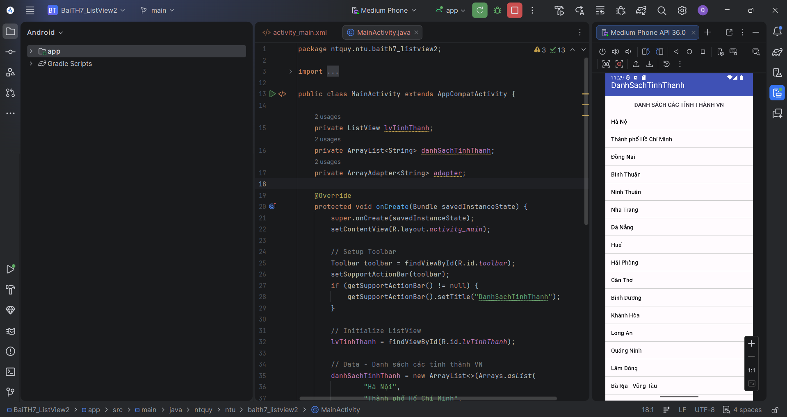
</p>

---

### 9. DanhSachVatLieuVaDanhSachMonAn — ListView Vật Liệu & Món Ăn

> 🟤 Ứng dụng ListView đa màn hình — Thực hành `ListView`, `ArrayAdapter` và điều hướng Activity.

- **Package:** `tiil.edu.baith7_listview1`
- **Thư mục:** `DanhSachVatLieuVaDanhSachMonAn/`
- **Mô tả:** Ứng dụng hiển thị danh sách với hai màn hình riêng biệt: **Danh sách Món Ăn** và **Danh sách Vật Liệu**. Người dùng chọn từ màn hình chính để điều hướng đến từng danh sách.
- **Các Activity:**
  - `MainActivity` — Màn hình chính với 2 nút điều hướng
  - `MonAnActivity` — Hiển thị danh sách món ăn
  - `VatLieuActivity` — Hiển thị danh sách vật liệu
- **Tính năng nổi bật:**
  - Điều hướng giữa các Activity bằng `Intent`
  - Sử dụng `ArrayAdapter` với layout tùy chỉnh
- **Kiến thức áp dụng:**
  - Tạo và quản lý nhiều Activity
  - Sử dụng `Intent` để chuyển màn hình
  - Đăng ký Activity trong `AndroidManifest.xml`

<p align="center">
  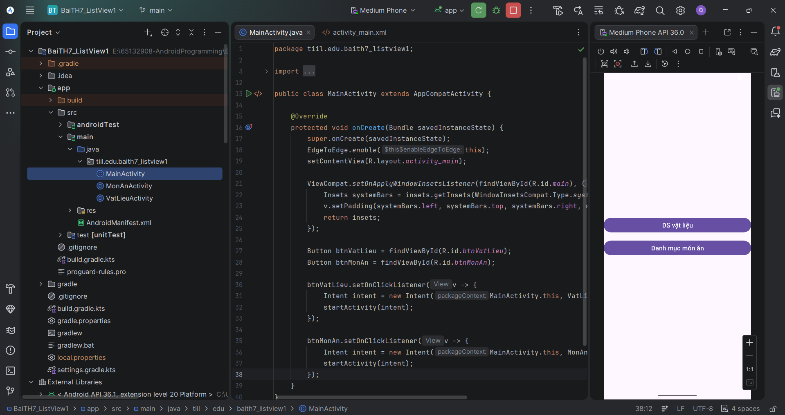
  &nbsp;&nbsp;
  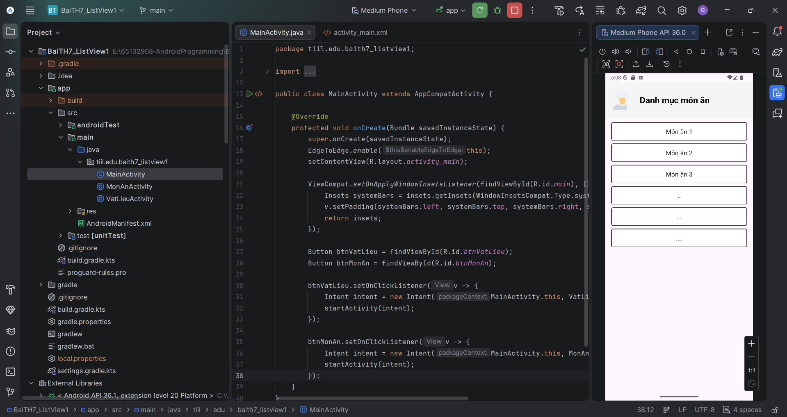
  &nbsp;&nbsp;
  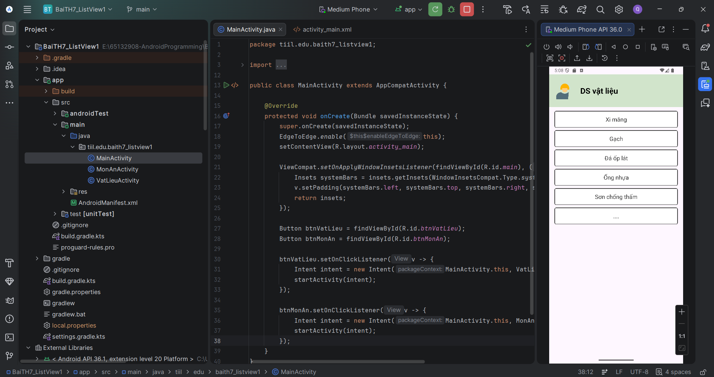
</p>

---

### 10. AppMonAn — Custom ListView Món Ăn

> 🟢 Custom ListView — Thực hành Custom Adapter với hình ảnh và dữ liệu phong phú.

- **Package:** `ntquy.ntu.appmonan`
- **Thư mục:** `AppMonAn/`
- **Mô tả:** Ứng dụng hiển thị danh sách món ăn (Cơm tấm sườn, Cơm gà xối mỡ, ...) với Custom ListView. Mỗi item hiển thị hình ảnh, tên món, giá và mô tả. Nhấn vào item sẽ hiển thị `Toast` với tên và giá món ăn.
- **Các lớp chính:**
  - `MonAn` — Model dữ liệu (hình ảnh, tên, giá, mô tả)
  - `MonAnAdapter` — Custom BaseAdapter
  - `MainActivity` — Hiển thị và xử lý sự kiện
- **Tính năng nổi bật:**
  - Custom item layout với hình ảnh + text
  - Custom `BaseAdapter` để bind dữ liệu
  - Sự kiện click item hiển thị `Toast`
- **Kiến thức áp dụng:**
  - Tạo Custom Adapter (`BaseAdapter`)
  - Sử dụng `LayoutInflater` để inflate layout
  - Tạo data model class
  - `setOnItemClickListener` trên `ListView`

<p align="center">
  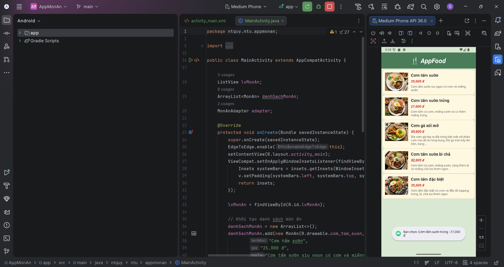
</p>

---

### 11. DSSinhVienVaMonHoc — ListView Sinh Viên & Môn Học

> 🟢 Ứng dụng quản lý danh sách Sinh Viên và Môn Học.

- **Package:** `tiil.edu.bailamthem1_listview`
- **Thư mục:** `DSSinhVienVaMonHoc/`
- **Mô tả:** Ứng dụng hiển thị hai danh sách: **Sinh Viên** và **Môn Học**. Mỗi danh sách được hiển thị trên một Activity riêng, điều hướng từ màn hình chính.
- **Các Activity:**
  - `MainActivity` — Màn hình chính với 2 nút: "Sinh Viên" và "Môn Học"
  - `SinhVienActivity` — Hiển thị danh sách sinh viên
  - `MonHocActivity` — Hiển thị danh sách môn học
- **Tính năng nổi bật:**
  - Điều hướng giữa các Activity bằng `Intent`
  - Sử dụng `ArrayAdapter` với layout tùy chỉnh
- **Kiến thức áp dụng:**
  - Mô hình đa Activity với `Intent`
  - Hiển thị dữ liệu với `ListView` + `ArrayAdapter`

<p align="center">
  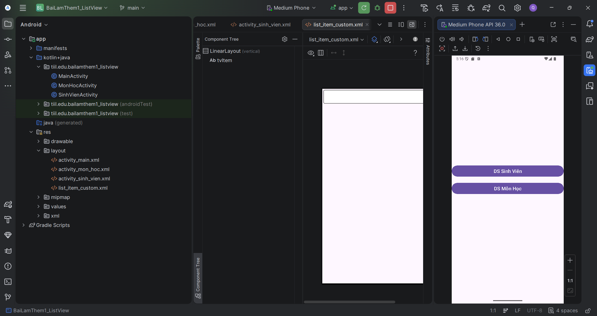
  &nbsp;&nbsp;
  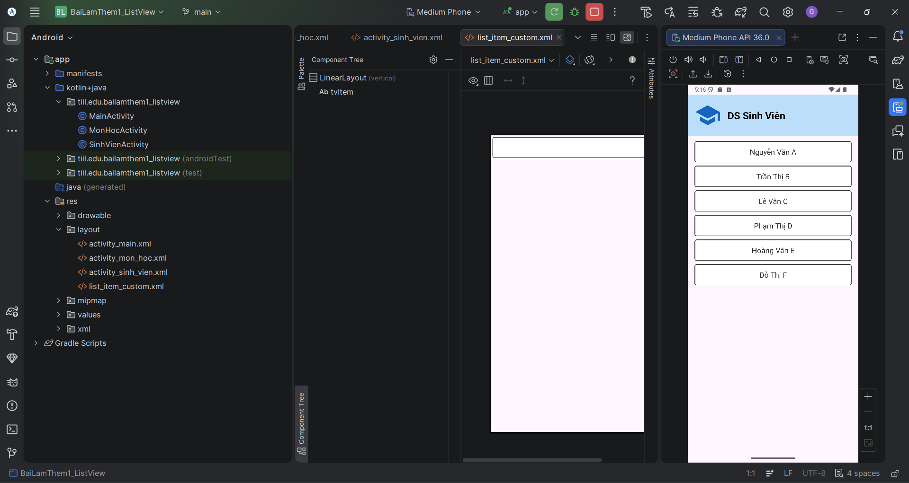
  &nbsp;&nbsp;
  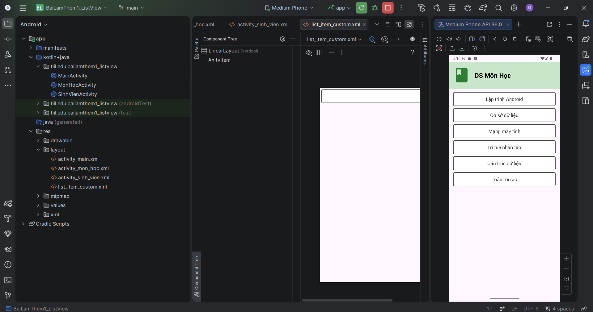
</p>

---

### 12. DSSanPhamVaNhaCungCap — ListView Sản Phẩm & Nhà Cung Cấp

> 🔴 Ứng dụng quản lý Sản Phẩm & Nhà Cung Cấp với tìm kiếm, thêm mới và lưu trữ dữ liệu.

- **Package:** `tiil.edu.bailamthem2_listview`
- **Thư mục:** `DSSanPhamVaNhaCungCap/`
- **Mô tả:** Ứng dụng nâng cao với hai danh sách: **Sản Phẩm** và **Nhà Cung Cấp**. Hỗ trợ thêm mới, tìm kiếm/lọc và lưu trữ dữ liệu bền vững bằng `SharedPreferences`.
- **Các Activity:**
  - `MainActivity` — Màn hình chính với 2 nút điều hướng
  - `SanPhamActivity` — Quản lý danh sách sản phẩm
  - `NhaCungCapActivity` — Quản lý danh sách nhà cung cấp
- **Tính năng nổi bật:**
  - 🔍 **Tìm kiếm/Lọc** danh sách theo thời gian thực với `TextWatcher`
  - ➕ **Thêm mới** sản phẩm/nhà cung cấp vào danh sách
  - 💾 **Lưu trữ bền vững** bằng `SharedPreferences`
  - 👆 **Xem chi tiết** khi nhấn vào item (hiển thị `Toast`)
- **Kiến thức áp dụng:**
  - Lưu trữ dữ liệu với `SharedPreferences`
  - Lọc danh sách với `TextWatcher` + `ArrayAdapter.getFilter()`
  - Thêm phần tử động vào `ArrayList` và cập nhật `Adapter`
  - Xử lý sự kiện `setOnItemClickListener` trên `ListView`

<p align="center">
  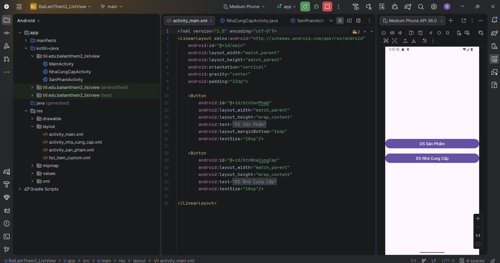
  &nbsp;&nbsp;
  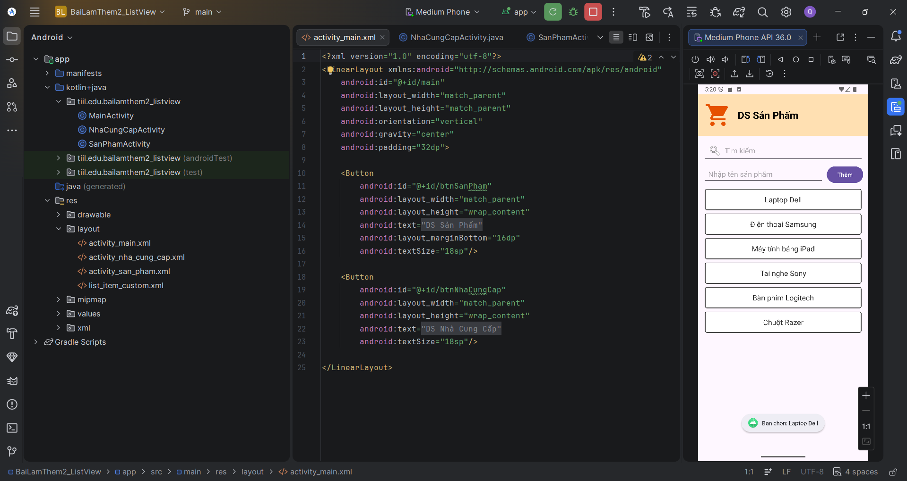
  &nbsp;&nbsp;
  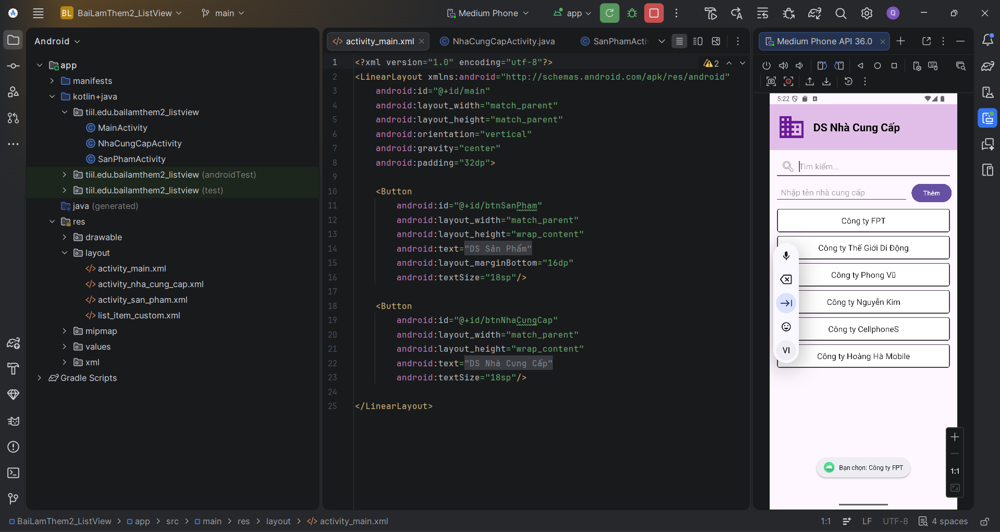
</p>

---

### 13. DanhSachCacCanhQuan — RecyclerView & CardView

> 🟣 RecyclerView + CardView — Hiển thị danh sách cảnh quan thế giới với hình ảnh.

- **Package:** `ntquy.ntu.danhsachcaccanhquan`
- **Thư mục:** `DanhSachCacCanhQuan/`
- **Mô tả:** Ứng dụng hiển thị danh sách 10 cảnh quan nổi tiếng thế giới (Flag Tower of Ha Noi, Eiffel Tower, Great Wall of China, Taj Mahal, ...) bằng `RecyclerView` với `CardView`. Nhấn vào item sẽ hiển thị `Toast` thông báo.
- **Các lớp chính:**
  - `CanhQuan` — Model dữ liệu (tên, hình ảnh)
  - `CanhQuanAdapter` — RecyclerView Adapter
  - `MainActivity` — Khởi tạo dữ liệu và xử lý sự kiện click
- **Tính năng nổi bật:**
  - Hiển thị danh sách với `RecyclerView` + `CardView`
  - Hình ảnh minh hoạ cho mỗi cảnh quan
  - Sự kiện click item bằng interface callback
- **Kiến thức áp dụng:**
  - `RecyclerView` với `LinearLayoutManager`
  - Tạo `RecyclerView.Adapter` và `ViewHolder`
  - Sử dụng `CardView` cho item layout
  - Xử lý sự kiện click bằng interface pattern (lambda)

<p align="center">
  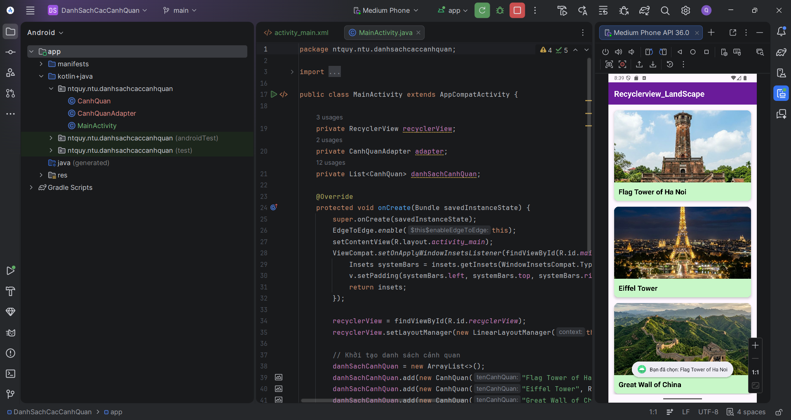
</p>

---

### 14. VN_Express_Rss — Đọc Tin RSS VnExpress

> 🔵 Ứng dụng đọc tin RSS — Tích hợp mạng, tìm kiếm, bookmark và làm mới dữ liệu.

- **Package:** `ntquy.ntu.bailamthem3_recyclerview`
- **Thư mục:** `VN_Express_Rss/`
- **Mô tả:** Ứng dụng đọc tin tức từ RSS feed VnExpress mục "Thế Giới" bằng `RecyclerView`. Hỗ trợ tìm kiếm, lưu tin yêu thích (bookmark) và kéo để làm mới dữ liệu.
- **Các lớp chính:**
  - `RssItem` — Model dữ liệu bài báo (tiêu đề, link, mô tả, hình ảnh, ngày)
  - `RssParser` — Parser XML từ RSS feed
  - `NewsAdapter` — RecyclerView Adapter
  - `MainActivity` — Quản lý logic chính
- **Tính năng nổi bật:**
  - 🔍 **Tìm kiếm** bài viết theo tiêu đề (SearchView)
  - ⭐ **Lưu tin yêu thích** bằng `SharedPreferences`
  - 🔄 **Kéo để làm mới** bằng `SwipeRefreshLayout`
  - 📡 **Tải dữ liệu RSS** từ mạng (background thread)
  - Lọc xem tất cả / chỉ tin yêu thích
- **Kiến thức áp dụng:**
  - Kết nối mạng và parse XML (RSS)
  - `RecyclerView` với custom adapter
  - `SharedPreferences` lưu trữ bookmark
  - `SwipeRefreshLayout` cho pull-to-refresh
  - `ExecutorService` + `Handler` cho xử lý bất đồng bộ
  - `SearchView` cho tìm kiếm thời gian thực

<p align="center">
  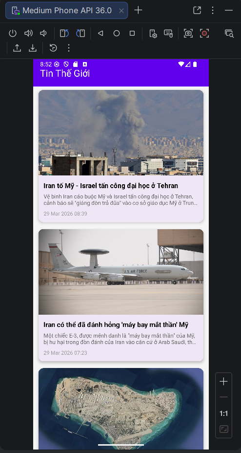
  &nbsp;&nbsp;
  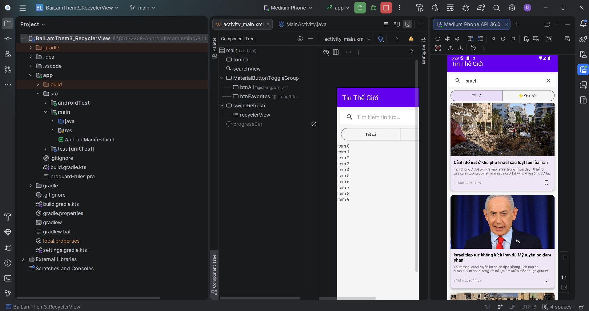
</p>
<p align="center">
  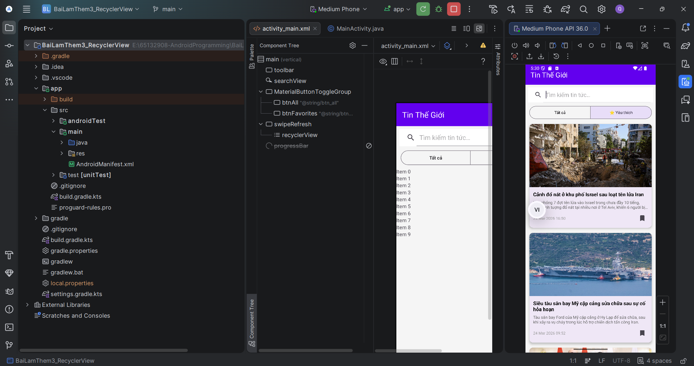
  &nbsp;&nbsp;
  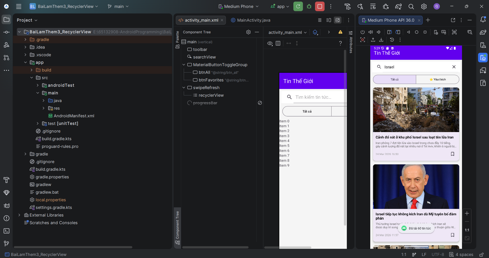
</p>

---

## 💻 Yêu cầu hệ thống

- **Android Studio** phiên bản Ladybug trở lên (khuyến nghị bản mới nhất)
- **JDK 11** trở lên
- **Android SDK** với API Level 36
- Thiết bị Android thật hoặc **Emulator** (min API 24)

---

## 🚀 Hướng dẫn cài đặt và chạy

1. **Clone repository:**
   ```bash
   git clone https://github.com/<username>/65132908-AndroidProgramming.git
   ```

2. **Mở project trong Android Studio:**
   - Mở Android Studio → `File` → `Open`
   - Chọn thư mục của ứng dụng cần chạy (ví dụ: `HelloAndroid/`, `VN_Express_Rss/`, ...)

3. **Sync Gradle:**
   - Android Studio sẽ tự động sync, nếu không hãy chọn `File` → `Sync Project with Gradle Files`

4. **Chạy ứng dụng:**
   - Chọn thiết bị/emulator từ thanh toolbar
   - Nhấn **▶ Run** hoặc `Shift + F10`

---

## 👨‍💻 Tác giả

- **MSSV:** 65132908
- **Môn học:** Lập trình Android

---

<p align="center">
  <i>⭐ Nếu repository này hữu ích, hãy cho mình một star nhé!</i>
</p>