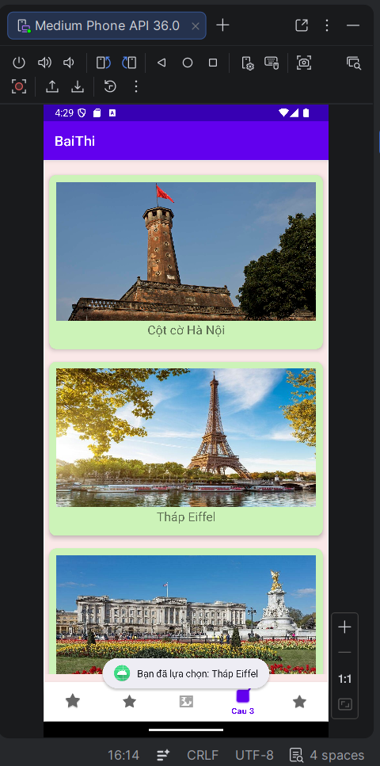
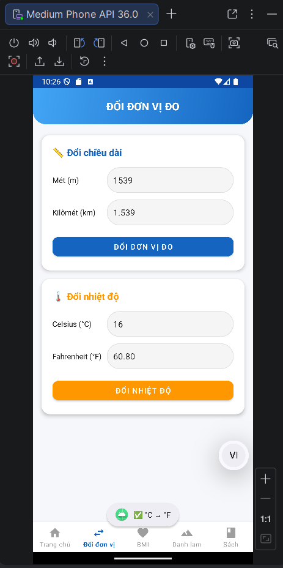
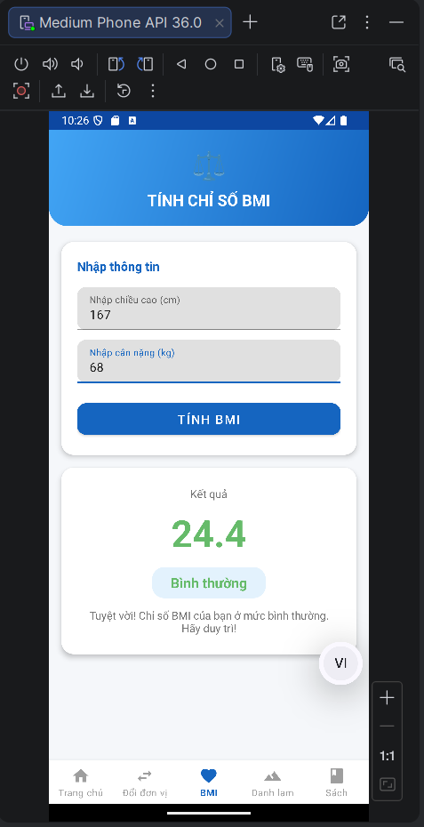
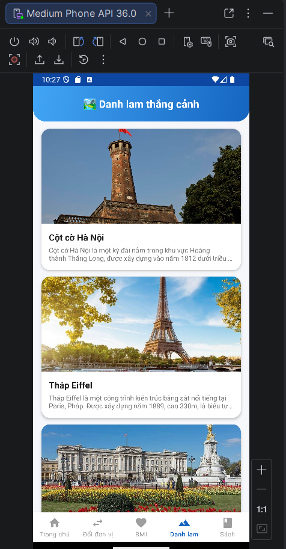
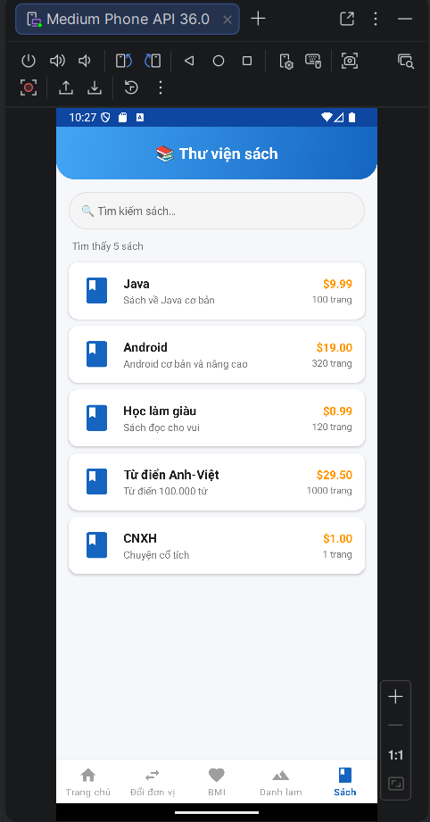
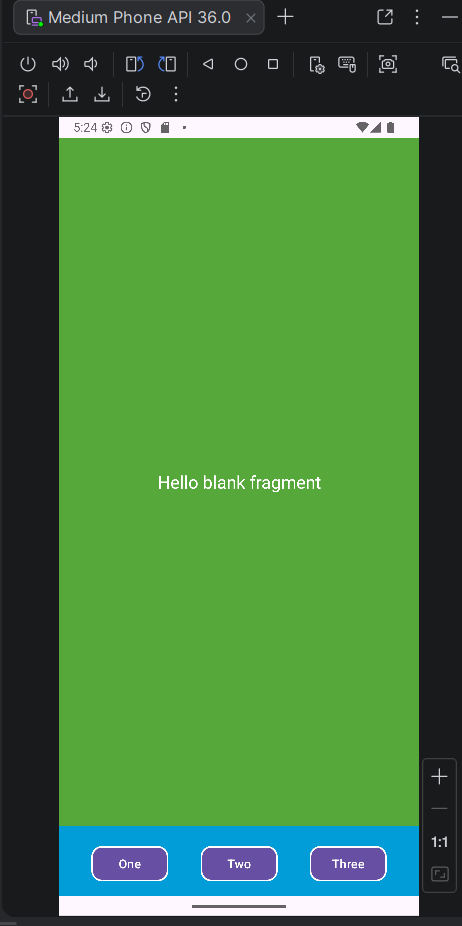
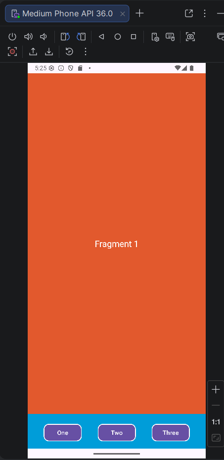
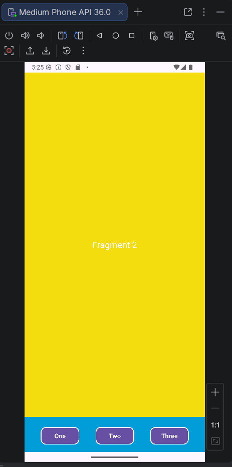
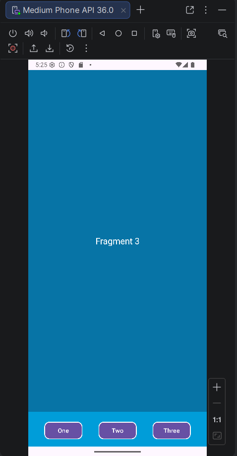
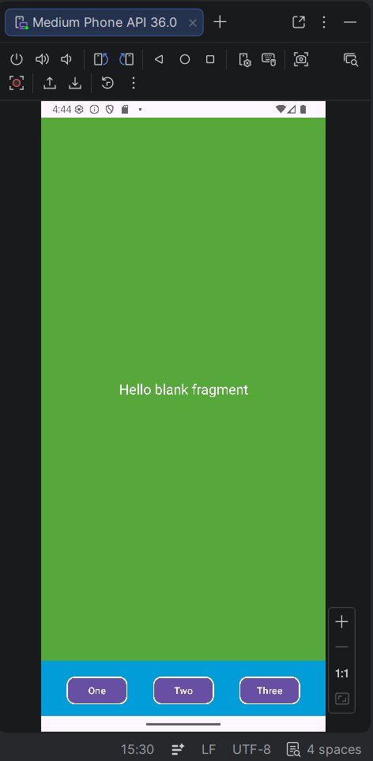

# 📱 65132908 - Android Programming

> Tổng hợp các bài thực hành môn **Lập trình Android** — Java, Android Studio.

---

## 🛠 Công nghệ

| | Chi tiết |
|---|---|
| **Ngôn ngữ** | Java 11 |
| **Build** | Gradle (Kotlin DSL & Groovy) |
| **SDK** | Min 24 · Target 36 |
| **Thư viện** | AndroidX, Material, RecyclerView, CardView, Glide, Fragment, BottomNavigationView, SQLite, AlertDialog, View Animation |

---

## 📦 Danh sách ứng dụng

### 17. BottomNavigationViewmenu — Bài Thi Nâng Cao (Fragment + BottomNav + SQLite + BMI)

📄 [MainActivity.java](BottomNavigationViewmenu/app/src/main/java/thi/quy65132908/baithi/MainActivity.java)

Ứng dụng bài thi tổng hợp nâng cao sử dụng `BottomNavigationView` với custom vector icon điều hướng giữa 5 Fragment: **Home** (animation), **Đổi đơn vị** (m ↔ km, °C ↔ °F), **BMI** (tính chỉ số BMI + phân loại + lời khuyên), **Danh lam** (RecyclerView 8 cảnh quan + AlertDialog), **Sách** (SQLite + RecyclerView + tìm kiếm realtime).

- **Lớp chính:** `MainActivity`, `HomeFragment`, `Cau1Fragment`, `Cau2Fragment`, `Cau3Fragment`, `Cau4Fragment`, `Book`, `BookAdapter`, `LandScape`, `LandScapeAdapter`
- **Kiến thức:** BottomNavigationView, Fragment, SQLiteDatabase, RecyclerView, CardView, AlertDialog, TextWatcher, BMI, vector drawable, View animation

<p align="center">
  
  &nbsp;&nbsp;
  
  &nbsp;&nbsp;
  
  &nbsp;&nbsp;
  
  &nbsp;&nbsp;
  
</p>

---

### 16. FragmentEx_Replace — Fragment Replace động (Button)

📄 [MainActivity.java](FragmentEx_Replace/app/src/main/java/ntquy/ntu/fragmentex_replace/MainActivity.java)

Minh hoạ thay thế Fragment **động** bằng `FragmentManager.replace()`. Màn hình chia 2 vùng: **Content** (trên) và **Footer** (dưới — chứa 3 nút). Nhấn từng nút để thay thế vùng Content bằng Fragment1 / Fragment2 / Fragment3.

- **Lớp chính:** `MainActivity`, `ContentFragment`, `FooterFragment`, `Fragment1`, `Fragment2`, `Fragment3`
- **Kiến thức:** FragmentContainerView, FragmentManager, `replace()` + `commit()`, giao tiếp giữa các Fragment

<p align="center">
  
  &nbsp;&nbsp;
  
  &nbsp;&nbsp;
  
  &nbsp;&nbsp;
  
</p>

---

### 15. FragmentExAddDynamic — Fragment Add động

📄 [MainActivity.java](FragmentExAddDynamic/app/src/main/java/ntquy/ntu/fragmentexadddynamic/MainActivity.java)

Minh hoạ thêm Fragment **động** bằng `FragmentManager.add()`. Hai Fragment (`ContentFragment` và `FooterFragment`) được thêm vào FrameLayout tại runtime thay vì khai báo trong XML.

- **Lớp chính:** `MainActivity`, `ContentFragment`, `FooterFragment`
- **Kiến thức:** FragmentManager, `beginTransaction().add()`, FrameLayout làm container, EdgeToEdge

<p align="center">
  
</p>

---

### 14. FragmentEx_Statically — Fragment tĩnh (XML)

📄 [MainActivity.java](FragmentEx_Statically/app/src/main/java/ntquy/ntu/fragmentex_statically/MainActivity.java)

Minh hoạ khai báo Fragment **tĩnh** trực tiếp trong layout XML bằng thẻ `<FragmentContainerView>` với thuộc tính `android:name`. Hai Fragment (`ContentFragment` và `FooterFragment`) được gắn cố định trong `activity_main.xml`.

- **Lớp chính:** `MainActivity`, `ContentFragment`, `FooterFragment`
- **Kiến thức:** FragmentContainerView, khai báo Fragment tĩnh trong XML, ConstraintLayout, EdgeToEdge

<p align="center">
  
</p>

---

### 13. VN_Express_Rss — Đọc Tin RSS VnExpress

📄 [MainActivity.java](VN_Express_Rss/app/src/main/java/ntquy/ntu/bailamthem3_recyclerview/MainActivity.java)

Đọc tin tức từ RSS feed VnExpress ("Thế Giới") bằng `RecyclerView`. Tải dữ liệu bất đồng bộ (`ExecutorService` + `Handler`), hiển thị ảnh bằng **Glide**, nhấn vào tin để mở trình duyệt.

- **Lớp chính:** `RssItem`, `RssParser`, `NewsAdapter`, `MainActivity`
- **Kiến thức:** Kết nối mạng, parse XML RSS, RecyclerView + Adapter, Glide, `Intent.ACTION_VIEW`

<p align="center">
  
</p>

---

### 12. DanhSachCacCanhQuan — RecyclerView & CardView

📄 [MainActivity.java](DanhSachCacCanhQuan/app/src/main/java/ntquy/ntu/danhsachcaccanhquan/MainActivity.java)

Hiển thị 10 cảnh quan nổi tiếng thế giới bằng `RecyclerView` + `CardView`. Nhấn item hiển thị `Toast`.

- **Lớp chính:** `CanhQuan`, `CanhQuanAdapter`, `MainActivity`
- **Kiến thức:** RecyclerView, CardView, ViewHolder, interface callback

<p align="center">
  
</p>

---

### 11. DSSanPhamVaNhaCungCap — ListView Sản Phẩm & Nhà Cung Cấp

📄 [MainActivity.java](DSSanPhamVaNhaCungCap/app/src/main/java/tiil/edu/bailamthem2_listview/MainActivity.java)

Quản lý hai danh sách **Sản Phẩm** và **Nhà Cung Cấp**. Hỗ trợ thêm mới, tìm kiếm/lọc realtime (`TextWatcher`) và lưu trữ bằng `SharedPreferences`.

- **Activity:** `MainActivity` → `SanPhamActivity`, `NhaCungCapActivity`
- **Kiến thức:** SharedPreferences, TextWatcher, ArrayAdapter filter, đa Activity

<p align="center">
  
  &nbsp;&nbsp;
  
  &nbsp;&nbsp;
  
</p>

---

### 10. DSSinhVienVaMonHoc — ListView Sinh Viên & Môn Học

📄 [MainActivity.java](DSSinhVienVaMonHoc/app/src/main/java/tiil/edu/bailamthem1_listview/MainActivity.java)

Hiển thị hai danh sách **Sinh Viên** và **Môn Học** trên hai Activity riêng, điều hướng bằng `Intent`.

- **Activity:** `MainActivity` → `SinhVienActivity`, `MonHocActivity`
- **Kiến thức:** Đa Activity, Intent, ListView + ArrayAdapter

<p align="center">
  
  &nbsp;&nbsp;
  
  &nbsp;&nbsp;
  
</p>

---

### 9. AppMonAn — Custom ListView Món Ăn

📄 [MainActivity.java](AppMonAn/app/src/main/java/ntquy/ntu/appmonan/MainActivity.java)

Hiển thị danh sách món ăn với Custom ListView (hình ảnh, tên, giá, mô tả). Nhấn item hiển thị `Toast`.

- **Lớp chính:** `MonAn`, `MonAnAdapter` (BaseAdapter), `MainActivity`
- **Kiến thức:** Custom BaseAdapter, LayoutInflater, data model, OnItemClickListener

<p align="center">
  
</p>

---

### 8. DanhSachVatLieuVaDanhSachMonAn — ListView Vật Liệu & Món Ăn

📄 [MainActivity.java](DanhSachVatLieuVaDanhSachMonAn/app/src/main/java/tiil/edu/baith7_listview1/MainActivity.java)

Hai màn hình **Món Ăn** và **Vật Liệu**, điều hướng từ màn hình chính bằng `Intent`.

- **Activity:** `MainActivity` → `MonAnActivity`, `VatLieuActivity`
- **Kiến thức:** Đa Activity, Intent, ArrayAdapter, AndroidManifest

<p align="center">
  
  &nbsp;&nbsp;
  
  &nbsp;&nbsp;
  
</p>

---

### 7. DanhSachCacTinhThanh — ListView Tỉnh Thành

📄 [MainActivity.java](DanhSachCacTinhThanh/app/src/main/java/ntquy/ntu/baith7_listview2/MainActivity.java)

Hiển thị 20 tỉnh thành Việt Nam bằng `ListView` + `ArrayAdapter`. Nhấn item hiển thị `Toast`.

- **Kiến thức:** ListView, ArrayAdapter, OnItemClickListener, Toolbar

<p align="center">
  
</p>

---

### 6. AppCongTruNhanChia — Cộng Trừ Nhân Chia

📄 [MainActivity.java](AppCongTruNhanChia/app/src/main/java/tiil/edu/baith5_xulysukien1/MainActivity.java)

Máy tính 4 phép tính cơ bản (Cộng, Trừ, Nhân, Chia) với xử lý chia cho 0.

- **Kiến thức:** setOnClickListener, tách logic thành phương thức riêng, kiểm tra điều kiện

<p align="center">
  
  &nbsp;&nbsp;
  
</p>

---

### 5. BaiTH4_2 — Máy Tính Bỏ Túi

📄 [MainActivity.java](BaiTH4_2LinearLayOut_Tong2So/app/src/main/java/tiil/edu/vd2/MainActivity.java)

Máy tính bỏ túi 4 phép tính (+, −, ×, ÷). Xử lý ngoại lệ chia cho 0 và nhập liệu không hợp lệ.

- **Kiến thức:** LinearLayout lồng nhau, setOnClickListener, try-catch NumberFormatException

---

### 4. BaiTH4_1 — LinearLayout & Button

📄 [MainActivity.java](BaiTH4_1LinearLayOut_Tong2So/app/src/main/java/tiil/edu/vd1/MainActivity.java)

Minh hoạ `LinearLayout` vertical với 3 nút bấm tuỳ chỉnh (chữ vàng, nền tím).

- **Kiến thức:** LinearLayout, tuỳ chỉnh Button (textColor, background, textSize)

---

### 3. AppCong — Tính Tổng (onClick XML)

📄 [MainActivity.java](AppCong/app/src/main/java/tiil/edu/appcong/MainActivity.java)

Nhập 2 số a, b → tính tổng. Xử lý sự kiện qua `android:onClick` trong XML.

- **Kiến thức:** ConstraintLayout, android:onClick, chuyển đổi String → int

---

### 2. AppTinhTong — Tính Tổng Hai Số

📄 [MainActivity.java](AppTinhTong/app/src/main/java/tiil/edu/appcong/MainActivity.java)

Nhập 2 số nguyên a, b → tính tổng. Gọi `XuLyCong` qua `android:onClick`.

- **Kiến thức:** android:onClick, findViewById, Integer.parseInt

<p align="center">
  
</p>

---

### 1. HelloAndroid

📄 [MainActivity.java](HelloAndroid/app/src/main/java/tiil/edu/helloandroid/MainActivity.java)

Ứng dụng "Hello World" cơ bản — hiển thị `TextView` ở giữa màn hình.

- **Kiến thức:** Tạo project Android, ConstraintLayout, vòng đời Activity (onCreate)

<p align="center">
  
</p>

---

## 🚀 Cài đặt và chạy

```bash
git clone https://github.com/<username>/65132908-AndroidProgramming.git
```

1. Mở Android Studio → `File` → `Open` → chọn thư mục ứng dụng cần chạy
2. Sync Gradle (`File` → `Sync Project with Gradle Files`)
3. Chọn thiết bị/emulator → nhấn **▶ Run** (`Shift + F10`)

> **Yêu cầu:** Android Studio Ladybug+, JDK 11+, Android SDK API 36, Emulator min API 24

---

## 👨‍💻 Tác giả

**MSSV:** 65132908 · **Môn học:** Lập trình Android

<p align="center">
  <i>⭐ Nếu repository này hữu ích, hãy cho mình một star nhé!</i>
</p>